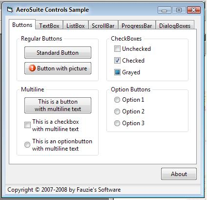



## AeroSuite ActiveX Controls \[16 Feb 08\]

### Description

Must SEE!!! This project includes VistaAeroForm, VistaBasicForm, and other controls with Vista visual style. PLEASE NOTE THAT THIS PROJECT ISN'T COMPLETED YET. Comments and suggestions are welcome.
 
### More Info
 

             |
---                |---
**Submitted On**   |2008-02-16 22:13:56
**By**             |[Fauzie](https://github.com/Planet-Source-Code/PSCIndex/blob/master/ByAuthor/fauzie.md)
**Level**          |Advanced
**User Rating**    |4.8 (187 globes from 39 users)
**Compatibility**  |VB 6\.0
**Category**       |[Custom Controls/ Forms/  Menus](https://github.com/Planet-Source-Code/PSCIndex/blob/master/ByCategory/custom-controls-forms-menus__1-4.md)
**World**          |[Visual Basic](https://github.com/Planet-Source-Code/PSCIndex/blob/master/ByWorld/visual-basic.md)
**Archive File**   |[AeroSuite\_2102962222008\.zip](https://github.com/Planet-Source-Code/fauzie-aerosuite-activex-controls-16-feb-08__1-70026/archive/master.zip)

